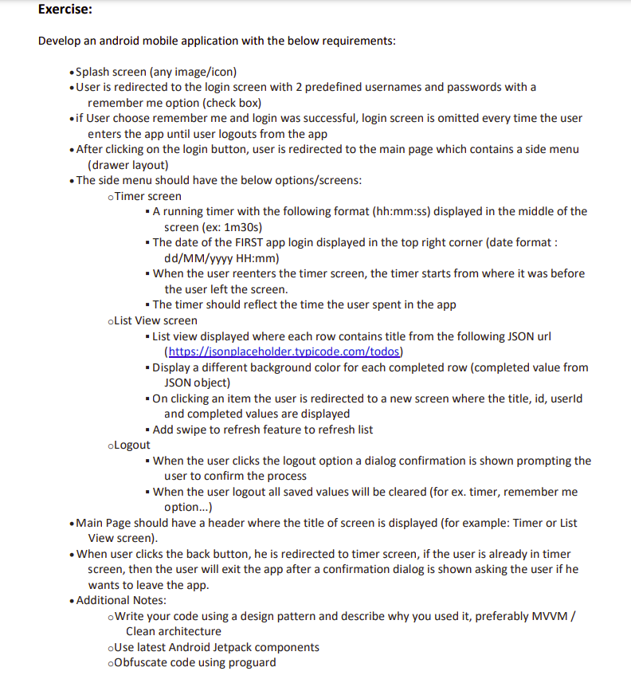

## Android Code Challenge

### Exercise



### Login Credentials

- Username: user1
- Password: password1

---

- Username: user2
- Password: password2

---

More info can be found
in [AuthRepositoryImpl#debug](app/src/main/java/com/amoukaled/androidcodechallenge/repositories/AuthRepositoryImpl.kt)
.

### Architecture

This project uses the MVVM architecture. Implementation of reactive programming is used
with `StateFlow` and `SharedPreferences.OnSharedPreferenceChangeListener`.

### Project Structure

```
-- com.amoukaled.androidcodechallenge
    -- activities: contains Activity classes
    -- adapters: contains the RecyclerView Adapters
    -- api: contains the api interfaces
    -- data:
        -- dao: contains Room Dao interfaces
        -- databases: contains Room databases
        -- datastore: contains both interfaces for key-value pair persistence with the implementations
        -- entities: contains the Room Entities
    -- di: contains Hilt modules
    -- fragments: contains Fragments classes
    -- models: contains model classes
    -- repositories: contains the repository interface with the implementation
    -- utils: contains util classes
    -- viewModels: contains ViewModel classes
```

### Repositories

- [AuthRepository](app/src/main/java/com/amoukaled/androidcodechallenge/repositories/AuthRepository.kt):
  For user authentication.
- [TimerRepository](app/src/main/java/com/amoukaled/androidcodechallenge/repositories/TimerRepository.kt):
  For Timer functionality.
- [TodoRepository](app/src/main/java/com/amoukaled/androidcodechallenge/repositories/TodoRepository.kt):
  For Todo state.

### Activities

- [StartupActivity](app/src/main/java/com/amoukaled/androidcodechallenge/activities/StartupActivity.kt):
  This activity is responsible for user authentication redirection. If the user is authenticated, it
  will push to `MainActivity`, otherwise `LoginActivity`.
- [LoginActivity](app/src/main/java/com/amoukaled/androidcodechallenge/activities/LoginActivity.kt):
  This activity is responsible for user authentication.

- [MainActivity](app/src/main/java/com/amoukaled/androidcodechallenge/activities/MainActivity.kt):
  NavigationUI with 3 menu options; Timer, List View, and Logout.

### NavigationUI Fragments

- [ListViewFragment](app/src/main/java/com/amoukaled/androidcodechallenge/fragments/ListViewFragment.kt):
  RecyclerView layout with swipe to refresh for Todos.
- [TimerFragment](app/src/main/java/com/amoukaled/androidcodechallenge/fragments/TimerFragment.kt):
  Layout indicating the time spent on a single login session with first login date and time display.
- [TodoFragment](app/src/main/java/com/amoukaled/androidcodechallenge/fragments/TodoFragment.kt):
  Once clicked on a Todo item in the `ListViewFragment`, this fragment is displayed with the `Todo`
  properties.

### Workflow

Every `Activity` registers and unregisters the listener (according to the lifecycle)
in `AuthRepositoryImpl#loginListener` that will refresh the `AuthRepository#authStateFlow` that
holds the current authentication state.

The way I am handling the `Timer` functionality is by accumulating screen time and persisting it
using [TimerDataStore](app/src/main/java/com/amoukaled/androidcodechallenge/data/dataStore/TimerDataStore.kt)
.

### Remarks

In a production app, I would use the PagingLibrary to reduce the list size in `TodoRepository` and
cache the Todos for offline use. I would retrieve the data directly from the local database to
display it, and on refresh I would update the database with the new Todos, refreshing the UI
dynamically. I refrained from implementing the Paging feature because it was not listed in the code
challenge.
